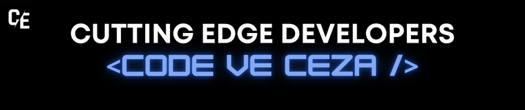
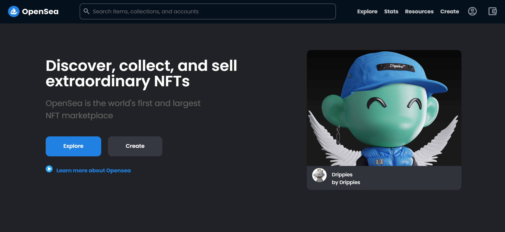

<h1 align="center">
  <a href="https://github.com/Cutting-Edge-Developers/code-ve-ceza"></a>
</h1>

<div align="center">
<br />
<a herf="./LICENSE"></a>
<a herf=".URL_"></a>
<a herf=".https://github.com/Cutting-Edge-Developers/code-ve-ceza/graphs/contributors"></a>

<a href="https://github.com/Cutting-Edge-Developers/code-ve-ceza/issues"></a>
<a href="https://github.com/Cutting-Edge-Developers/code-ve-ceza/pulls"></a>
</div>

> Opensea.io Clone

<!-- Screenshots -->
### Ekran Görüntüleri

<div align="center"> 
  
</div>

## Kurulum

```bash
git clone https://github.com/Cutting-Edge-Developers/code-ve-ceza.git
cd code-ve-ceza
```

## Katkıda Bulunanlar ✨

<div style ="margin-top:2rem; margin-bottom:2rem;"> 
<a href="https://github.com/Cutting-Edge-Developers/code-ve-ceza/graphs/contributors">
  
</a>


## Lisans

Bu proje, [Cutting-Edge-Developers](https://github.com/Cutting-Edge-Developers) Lisansı kapsamında lisanslanmıştır - bkz. [LİSANS](./LICENSE). ayrıntılar için dosya